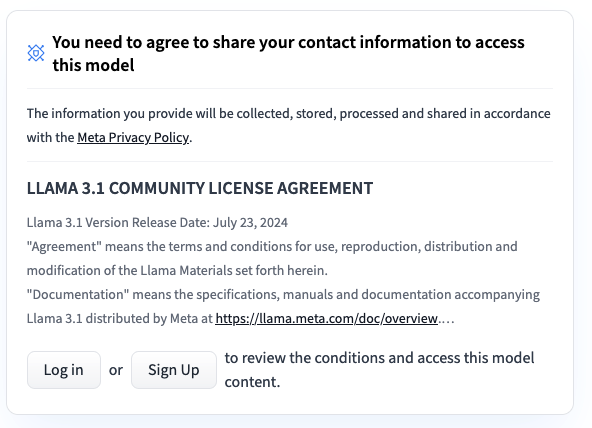
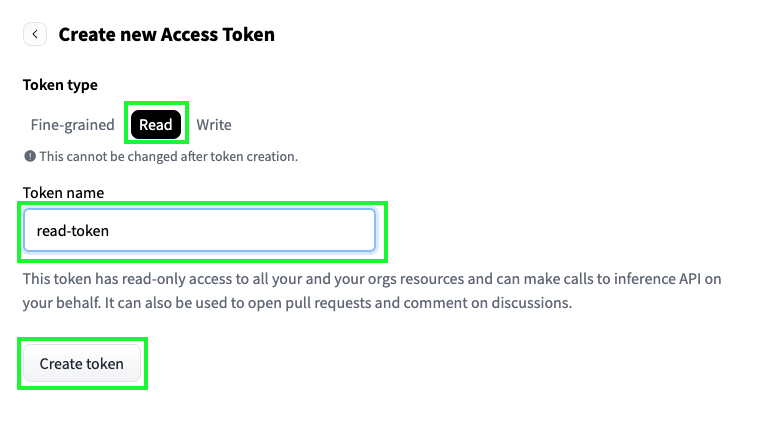

<h1 align="center">Pallma Guard</h1>
<p align="center">
  <p align="center"><strong>The Security Observability Layer for AI Agents.</strong></p>
</p>

<h4 align="center">
   <a href="https://github.com/pallma-ai/pallma-guard/actions/workflows/ci.yml">
      
   </a>
   <a href="https://github.com/traceloop/openllmetry/blob/main/LICENSE">
      
  </a>
</h4>


# pallma-guard

The Security Observability Layer for AI Agents.

Pallma-Guard is a security observability platform designed specifically for the era of AI agents and LLM-powered applications. As agents execute complex tasks, they create a new, dynamic attack surface vulnerable to threats like prompt injection, data leakage, and insecure tool usage.

Pallma-Guard leverages **OpenTelemetry** to trace every step of an agent's decision-making process—its "chain-of-thought." These traces are then fed into purpose-built **open-source** ML models to detect, analyze, and block threats in real-time, giving you unprecedented visibility and control over your AI systems.

## ✨ Key Features

* 🛡️ **Real-time Threat Detection:** Identify malicious prompts, data exfiltration attempts, and anomalous agent behavior as it happens.
* 🔎 **LLM-Specific Analysis:** Go beyond simple text matching. Understand the context of LLM interactions to detect nuanced threats.
* 🔓 **Transparent & Auditable Security Models:** No black boxes. Our core ML models are fully open-source. Inspect the logic, contribute improvements, or fine-tune them.
* ⚙️ **Minimal Configuration:** Get started in minutes. Pallma-Guard is designed to work out-of-the-box with no complex rule-writing, providing immediate value right after installation.
* 🔌 **OpenTelemetry Native:** Seamlessly integrate with your existing observability stack. If you use OTel, you can use Pallma-Guard.
* 🤖 **Framework Agnostic:** Works with LangChain, LangGraph, LlamaIndex, Haystack, LiteLLM, CrewAI.


## 🤔 Why Pallma-Guard?

Traditional security tools (WAFs, APMs) are blind to the internal logic of AI agents. They see an API call, but not the malicious prompt that caused it.

Even newer AI security solutions can operate as a "black box," asking you to trust their proprietary logic. **Pallma-Guard is different.** Our commitment to open-source extends to our core security models. This transparency allows for community auditing, eliminates vendor lock-in, and empowers you to understand exactly how your agents are being protected.


## Prerequisites

Before running pallma, ensure you have the following installed:

- **Python 3.12+**
- **Docker and Docker Compose**
- **uv** (Python package manager)
- **Hugging Face Hub Token** (for the predictor service), with permission to access the [model on HuggingFace](https://huggingface.co/meta-llama/Llama-Prompt-Guard-2-22M).

## Requesting access to the model

1. Request access to the [model](https://huggingface.co/meta-llama/Llama-Prompt-Guard-2-22M) on HuggingFace. [Log in](https://huggingface.co/login) to HuggingFace (create an account if you don't have one). You’ll see a form at the top of the [model page](https://huggingface.co/meta-llama/Llama-Prompt-Guard-2-22M) - fill it out and wait for access, this might take some time.


2. Create a token to download the model. Create one in the [tokens section of your HuggingFace account](https://huggingface.co/settings/tokens). Read-only token should be enough:


## Installation

1. **Clone the repository:**
   ```bash
   git clone https://github.com/pallma-ai/pallma.git
   cd pallma
   ```

2. **Install dependencies:**
   
   Install all dependencies (CLI + SDK):
   ```bash
   make install-all
   ```
3. **Activate the virtual environment:**
   
   ```bash
   source .venv/bin/activate
   ```

## Configuration


### Environment Variables

Set the following environment variable for the predictor service:

```bash
export HUGGINGFACE_HUB_TOKEN="your_huggingface_token_here"
```

You can get a Hugging Face token from [https://huggingface.co/settings/tokens](https://huggingface.co/settings/tokens).

## Running the Application

The project includes a CLI tool for easy management:

```bash
# Start all services
pallma start

# Display real-time statistics
pallma display

# Stop all services
pallma stop
```

The display command shows real-time statistics including:
- Total number of messages
- Percentage of allow/block decisions
- Real-time updates as messages arrive

## Services

The application consists of the following services:

- **Zookeeper**: Apache Kafka dependency
- **Kafka**: Message broker for telemetry data
- **OpenTelemetry Collector**: Collects and forwards telemetry data to Kafka
- **Processor**: Processes telemetry data from Kafka
- **Predictor**: ML service for predictions (requires Hugging Face token)

## Development

### Development Commands

```bash
# Install development dependencies
make install-dev

# Run linting
make lint

# Install specific dependency groups
make install-cli
make install-sdk
```

## Troubleshooting

1. **Network issues**: Ensure the `pallma-network` Docker network exists
2. **Hugging Face token**: Make sure `HUGGINGFACE_HUB_TOKEN` is set
3. **Port conflicts**: Check if ports 2181, 9092, 4317, 4318 are available
4. **Service health**: Use `docker-compose ps` to check service status

## License

See [LICENSE](LICENSE) file for details.